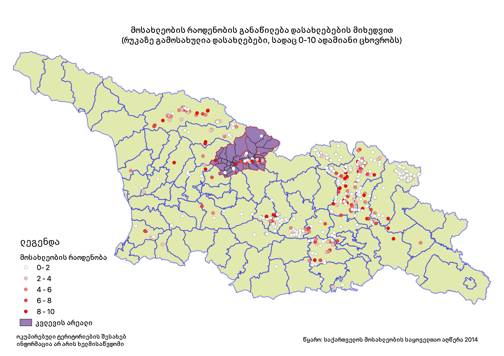

საქართველოში ქალაქის მოსახლეობამ სოფლად მცხოვრები ადამიანების რაოდენობას წინა საუკუნის 70-იან წლებში გადააჭარბა, მას შემდეგ ურბანიზაციის დონე ინარჩუნებს მზარდ ტენდენციას [@Hakkert2017]. აღნიშნული განსაკუთრებით მკვეთრად გამოიხატა საქართველოს მთიან რეგიონებში, რომლებიც მეჩხრად დასახლებული სოფლების უმეტესობას მოიცავს და მოსახლეობისაგან დასახლებების დაცლის (დეპოპულაციის) პრობლემა ყველაზე მწვავედ დგას (იხ. რუკა). 

სოფლების დაცარიელების ტენდენცია ნათლად გამოჩნდა საქართველოს ისტორიულ-გეოგრაფიული მხარის, რაჭა-ლეჩხუმისა და ქვემო სვანეთის რეგიონი მაგალითზეც. კერძოდ, საქართველოს მოსახლეობის საყოველთაო აღწერების მიხედვით, რაჭა-ლეჩხუმისა და ქვემო სვანეთის რეგიონის მოსახლეობა რადიკალურად შემცირდა (37.4 %-ით) 2002-2014 წლების განმავლობაში. აღნიშნული მაჩვენებელი ბოლო აღწერებს შორის პერიოდში ყველაზე მაღალია საქართველოს  სხვა რეგიონებთან შედარებით.

რაჭა-ლეჩხუმისა და ქვემო სვანეთის რეგიონს, რომელსაც ასევე შეეხო ქვეყნისთვის დამახასიათებელი ეს ზოგადი ტენდენცია, გამოიკვეთა უკუმიგრაციის შემთხვევები. მხარის სოციო-ეკონომიკური მდგომარეობიდან გამომდინარე, განსაკუთრებით მნიშვნელოვანია ამ პროცესის სიღრმისეული შესწავლა და ახალი ინფორმაციის წარმოება, რათა შემდეგში, მეცნიერული ცოდნით  გამყარებულმა პრაქტიკულმა გადაწყვეტებმა ეფექტიანად უზრუნველყოს ახალი მოსახლეების ადაპტაცია და რეგიონის მდგრადი განვითარება. 

კვლევითი პროექტის მიზანია შინამეურნეობების ეკონომიკური საქმიანობების ადაპტაციის პროცესის შესწავლა უკუმიგრაციის ფონზე ამბროლაურისა და ონის მუნიციპალიტეტების მაგალითზე. 

კვლევითი პროექტის ხელმძღვანელი - [**პროფ. იოსებ სალუქვაძე**](https://scholar.google.com/citations?user=knUVF8sAAAAJ&hl=en)  

პროექტის კოორდინატორი - [**გვანცა სალუქვაძე**](https://scholar.google.com/citations?user=KP-aQeYAAAAJ&hl=en)

მკვლევარი - [**თემურ გუგუშვილი**](https://scholar.google.com/citations?user=XIuUIMwAAAAJ&hl=en) 

